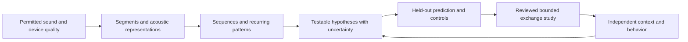

# Nature Station: from encounters to shared signals

Decision and implementation record, October 1, 2026. Talk2Nature / Metivity/talk2nature. This updates the device sequence in [PHASE_TWO_PLAN.md](PHASE_TWO_PLAN.md) following Raviv's request for spare phones, encounter histories and a more ambitious learning system. The long-term vision is a distributed observatory of nonhuman communication. Only the bounded browser prototype below is implemented.

## Three connected products

1. **Nature Station:** give a spare phone a listening role. Capture permitted sound events, device quality and periods of observation. A native version should work through screen locking and temporary loss of connectivity, within explicit schedules and limits.
2. **Encounter Journal:** connect sounds to independently observed actions, a person's naturally occurring voice, timing, uncertainty and unsuccessful attempts. A useful personal journal comes before any translation claim.
3. **Signal Lab:** a later scientist-led environment for a small, voluntary exchange with a defined animal population. Distinguish understanding an animal's existing signals from teaching a new shared interface. Both are interesting; success in one does not establish the other.

The *Project Hail Mary* analogy is productive: start with shared observations, repeated patterns and tests of hypotheses. Unlike fiction, an attractive interpretation must survive alternative explanations. A system that says “I am hungry” fluently is not evidence that a recording means that.

## What works now

[Nature Station](https://metivity.github.io/talk2nature/tools/station/) is a public, local-only browser tool. No account, server call for recordings, browser persistence, trained model or admission to the private database is involved.

- Explicit microphone start after a recording-permission declaration and the browser's own permission. Stop cancels a pending permission request; a late-granted stream is immediately stopped.
- A silent synthetic mode runs invented tones through the same AudioContext/worklet, without opening a microphone. The worklet zeros every speaker output. Live microphone monitoring and automatic animal playback are absent.
- Three seconds of baseline estimation, then a simple level threshold. Roughly one second of pre-roll and half a second of trailing quiet surround a detected event; sustained sound is split at approximately six seconds per clip. Wind, speech and machinery can trigger it. There is no species or speech classifier.
- A five-minute foreground limit, 24-clip / 24 MiB stored-audio limits, explicit stop, and stop on hidden page, interrupted audio or missing frames. A wake lock is requested where supported, but is not a background-recording guarantee.
- Timestamped voice and observation markers on the audio sample clock. Ten-second windows report a following detected sound, none detected, an incomplete window, or a discarded sound. Calibration is not counted as a complete quiet window. A detected sound may be the observer's own voice.
- After stopping: review source labels and notes, load a clip for manual playback, save individual PCM16 mono WAVs, export `talk2nature.station.v1` JSON, or discard. JSON does not embed audio. Listen can open an exported WAV for finer annotation; it does not import the Station journal.
- Discarding a clip removes its audio and review text from the session, while retaining its ID/onset to prevent deletion being mislabeled as silence. Discarding the session clears those too. Previously downloaded files remain on the device.
- A large-screen layout on the same device. Remote TV pairing is not implemented.

Timing is approximate: frames are 100 ms, the final partial frame is not retained, markers use the most recently processed frame, and browser/device latency is not calibrated. Station 0.2 introduced a session UUID, an unverified device UTC start time and unique filenames. Event offsets remain relative; station clocks are not synchronized. Browser JSON exports include WAV SHA-256 values; save the WAVs separately. This is a preliminary personal record, not a research manifest, consent receipt or admitted release. Clips omitted for storage limits retain an ID/onset tombstone so they are not counted as silence.

The [mobile Field Companion](https://metivity.github.io/talk2nature/app/) now presents this engine in outdoor, companion and synthetic workflows, alongside Listen's Sound desk. Its optional offline cache saves public app files only. See [the mobile audit](MOBILE_AUDIT.md) for installation, design, testing and distribution decisions.

Use **Try without a microphone → add a test voice marker → Stop recording → review a sound → Save session · ZIP** to explore without recording a household. For microphone use, choose a permitted setting, observe naturally, and review recordings privately with headphones away from animals. A permission checkbox cannot establish the rights or consent of everyone who might be audible.

## Devices: an explicit sequence

| Surface | Role | Next decision and constraint |
| --- | --- | --- |
| Mobile browser | Short sessions and encounter review | Implemented; physical Android/iOS testing remains necessary. Keep visible; no all-day promise. |
| Dedicated Android phone | First proposed unattended station | Native foreground service, visible notification and stop action, bounded offline queue. Test one available spare device first. |
| iPhone/iPad | Later native station | Audio background modes can support recording; validate interruption, power, storage and distribution behavior on actual devices. |
| TV | Review display | Pair temporarily to a station; expose minimal data, never leave owner-admin credentials on a shared display. |
| Alexa / Google Assistant | Potential control or review interface | Do not assume third-party skills receive a raw ambient microphone stream. Validate a specific supported integration before designing around it. |
| Tree/fungal sensors | Separate research track | Phone audio does not replace appropriate ultrasonic or electrical sensing, calibration and controls. |

Android permits continued microphone capture through an eligible foreground service, with microphone permissions and restrictions on background/boot starts. This supports a user-started station, not silent boot recording. [Official Android requirements](https://developer.android.com/develop/background-work/services/fgs/service-types#microphone).

Apple documents a recording audio-session category; background capability and interruptions still require native implementation and device tests. [Apple audio recording category](https://developer.apple.com/documentation/avfaudio/avaudiosession/category-swift.struct/record). Google's Conversational Actions were discontinued in 2023; that does not remove all Google device integrations. [Google sunset notice](https://developers.google.com/assistant/ca-sunset). Standard Alexa custom-skill documentation describes structured requests; treating it as an unrestricted ambient-audio API would be an unsupported assumption. [Amazon request interface](https://developer.amazon.com/en-US/docs/alexa/custom-skills/request-types-reference.html).

## Can an LLM-style training process help?

Yes, for learning representations and sequence structure. The missing ingredient is grounding: which sound patterns relate to which independently observed events, for whom, and under what conditions? Human language training benefits from enormous existing symbolic records and shared human contexts. Animal audio usually lacks reliable transcriptions and intended-meaning labels.



The proposed architecture proceeds in evidence stages:

1. **Acoustic representation.** First compare a frozen, appropriately licensed bioacoustic encoder plus a small classifier with basic acoustic features. Preserve unknown and overlapping sources. Detect clipping and noise; a privacy classifier can flag speech for review but cannot guarantee privacy.
2. **Temporal representation.** When data justify it, learn masked segments, next-event distributions, contrastive embeddings or recurring units over sequences. Preserve pauses, overlap and individual variation. Discovered clusters are acoustic patterns, not automatically words.
3. **Grounded encounter model.** Align representations with independently labeled behavior, context, source identity confidence, pre-event conditions and observer voice. Predict a bounded observable outcome with calibrated uncertainty. Compare audio-only, context-only, background-only and combined models. Abstain on unfamiliar devices, species or settings.
4. **Hypothesis workbench.** Retrieve similar reviewed encounters and show competing explanations. An LLM may summarize these records and cited research, with explicit evidence and uncertainty. It must not generate its own meaning labels and train on them as ground truth.
5. **Bounded exchange.** Only after a qualified lead defines the question, evaluate a small voluntary signal/response protocol with controls, predefined outcomes and welfare stop rules. Native-call playback and a learned button/sound interface are different experiments. Optimize for validated information and welfare, not response frequency. No online agent should autonomously provoke an animal to maximize engagement.

NatureLM-audio is a concrete architecture reference: its documentation describes an audio encoder coupled to a language model, with classification, detection and captioning tasks. Those capabilities motivate comparison, not a claim of validated general animal translation. No weights were installed or evaluated in this release; inspect each exact artifact's license and training overlap before use. [Official project documentation](https://projects.earthspecies.org/naturelm-audio/latest/), [source repository](https://github.com/earthspecies/NatureLM-audio), [existing model decisions](MODEL_DATA_DECISION.md).

## What would count as progress toward communication?

A preregistered example question could be: does a defined signal predict a specific observable behavior beyond context alone in previously unseen individuals and sessions? That establishes a bounded association. A separate controlled receiver-response experiment is needed to support a causal interpretation or exchange.

- Preserve naturally occurring comparison periods and failed attempts. “No detector event” is not “the animal said nothing.” The current level-triggered clips oversample louder sounds; they cannot provide an unbiased all-day conversation corpus.
- A future approved collector should retain consented random background windows, detector decisions and interruption gaps. Choose windows and hypotheses before inspecting outcomes. Do not retrofit a time window around a compelling example.
- Mark observer speech separately. A sound after a voice may be continuing speech, another animal, chance, movement or an environmental event. Matched quiet periods, context controls and later randomized controls distinguish some alternatives.
- Split by connected animals, households, devices, sessions and sources as appropriate. Use independent annotators, measure agreement, and inspect identity uncertainty, duplicate recordings and pretrained-model contamination.
- Freeze a held-out evaluation; report calibration, false alarms, abstentions and negative results alongside predictive performance. Require an independent reproduction before a communication claim becomes publicity.

This release provides instrumentation for observation, not an approved animal experiment. Research admission remains closed pending a protocol, qualified collaborator, rights, consent and hosted operational checks.

## Microphone quality and cost

Record actual input/processing sample rates, channel choice and reported gain/noise/echo processing. Requested settings may be ignored. Current capture takes the first input channel, reports the browser's available settings and near-full-scale fraction, and expresses levels in dBFS, not calibrated dB SPL. Quiet sound can be lost in noise or processing; a high sample rate alone does not establish microphone bandwidth. Ordinary phones should not be assumed to capture bat/plant ultrasound.

Before field work, compare candidate phones against a reference recorder with a documented, repeatable indoor test away from animals. Examine clipping, sensitivity, frequency response, wind/handling noise, placement and repeatability. Do not play calibration signals at wildlife. Keep raw-versus-processed lineage and model/device IDs in a future reviewed intake schema.

Uncompressed mono PCM16 at 48 kHz is 96,000 bytes/second: 345.6 MB/hour or 8.2944 GB/day per phone, using decimal units. A thousand continuously recording phones would produce about 8.29 TB/day before replication, metadata or analysis. At 16 kHz the per-phone figure is still 2.7648 GB/day. Event selection reduces volume and changes sampling bias; neither effect should be hidden.

The approved $50/month private-hosting budget is a small-pilot constraint, not a funded global audio network. Start with bounded local clips and reviewed batches. Define per-station quotas, retention, consented sampling, expected compute and an explicit budget before scaling. Do not continuously stream raw household audio into an LLM API.

## Database and contribution design

Reuse the existing private Python API/PostgreSQL design; store admitted media in dedicated private object storage, not database rows or GitHub Pages. A future queue can run quality checks and embeddings. Use short-lived, scoped transfers, content hashes, idempotency keys and resumable batches. No ingestion endpoint was added by this release.

The future database should connect station, device profile, protocol version, session, clock quality/gaps, media object, event, context marker, identity confidence, permission scope, review version and frozen dataset release. A user's interpretation must be separate from independent observations and model hypotheses. Differentiate personal journal retention, research review, training and public sharing permissions. Station exports alone establish none of these.

Invite contributors into one study; quarantine submissions and review source, rights, quality and protocol fit before release. Use role separation, quotas and provenance rather than a volume leaderboard. Keep coarse location only when needed; protect sensitive wildlife locations. Withdrawal must reconcile objects, derived features, release manifests and restored backups, with clearly disclosed limits for prior downloaded releases or trained models.

## Next bounded milestone

Build and test an Android capture service on one identified spare phone using synthetic input first: visible start/stop notification, session schedule, encrypted bounded local queue, correct interruption handling, local review and deletion. Rehearse 1-, 8- and 24-hour runs, charging/thermal behavior, lock/unlock, calls, permission revocation, restart and offline recovery. Automatic boot capture and cloud uploads are outside this first native milestone. Select SDK/device versions before implementation; no app-store support claim until measured.

The immediate public browser acceptance checks are: synthetic pipeline, marker timing, source review, separate exports, no autoplay, cancellation cleanup, storage/time bounds, desktop/mobile layout, and live deployment. Physical microphone response and unattended-device reliability require separate hardware tests. The private backend is unchanged.

```sh
python3 -m unittest discover -s tests -v
node --test tests/demo.test.mjs tests/listen.test.mjs tests/station.test.mjs
python3 web/build.py
python3 scripts/check_site.py
```

Browser permission and wake-lock behavior were checked against [getUserMedia documentation](https://developer.mozilla.org/en-US/docs/Web/API/MediaDevices/getUserMedia) and the [Screen Wake Lock API](https://developer.mozilla.org/en-US/docs/Web/API/Screen_Wake_Lock_API). Platform/model documentation review is not a hardware test or a new full-text scientific literature review.

## Version 0.3: one session download

**Save session · ZIP** includes the journal JSON, every retained PCM16 WAV and a short readme. The uncompressed ZIP is generated entirely in memory, with bounded size and flat generated filenames. Journal SHA-256 values describe the exact included WAV bytes; ZIP CRCs support file-manager integrity checks. Discarded audio is excluded while its existing event tombstone remains in JSON. Empty sessions can still save their journal. JSON-only and individual WAV downloads remain available.

Export locks session-changing controls and snapshots metadata/audio before asynchronous hashing. An invalid alias opens Session settings, focuses the field and gives a repair instruction. Downloads are requested, not confirmed by the browser API: check the saved file before leaving. The ZIP is not encrypted. Unzip it before opening one WAV in Review; session JSON is not a Listen annotation import. No new upload, browser persistence or research-admission path exists.
