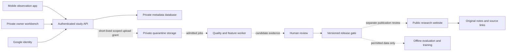

# Private architecture and contribution controls

30 September 2026. Status: local, synthetic metadata prototype implemented. Google provider configuration and cloud deployment pending. Public GitHub Pages remains the research publication site.

## Architecture decision

Use a **small Python API with a same-origin owner web interface**, and separate public publication from private collection. Start with one deployable application. Add a background worker when admitted recordings and a measured job justify it; do not start with a cluster or a continuously running GPU.

The local adapter is SQLite. The proposed hosted pilot is a stateless FastAPI service on Cloud Run with managed PostgreSQL and private object storage; Supabase is a candidate for the latter two services. This is conditional on a dedicated Talk2Nature account/project, region and budget. Do not run the SQLite file on ephemeral Cloud Run storage. The hosted database adapter, infrastructure, worker and object store are **not implemented**. Supabase Auth is an alternative managed authentication approach to evaluate at the hosting gate; the current implementation uses Google Identity Services directly and does not also provision a second identity system.

Solid API/owner/database functionality exists locally for synthetic metadata. Dashed media, worker, training and publication flows are a design. No public website build reads the private store.

## Current identity and trust boundary

- Only `raviv@metivity.com` may initialize the owner identity. A verified Google Workspace `hd=metivity.com` claim is required for automatic first binding; another person in that domain is denied. If this address is not a Workspace account, stop and explicitly configure the verified Google subject; do not weaken to email-only authorization.
- Google-auth verifies signature, audience, expiry and issuer. The application binds a one-time nonce to the initiating browser, checks the exact request Origin and pins the stable `sub` in private storage. An optional `T2N_OWNER_SUB` pins it before the first login. Account-email reuse with a different subject is denied. [Google verification guidance](https://developers.google.com/identity/gsi/web/guides/verify-google-id-token).
- A random opaque session is stored as a SHA-256 digest, lasts four hours and is revoked on logout. HTTPS uses an HttpOnly, Secure, SameSite=Strict, host-only cookie. The loopback HTTP exception is for development. Every private API checks the owner session; every mutation also checks Origin and a session CSRF token. No tokens in localStorage, URLs or the public build.
- The Google ID token is used only to authenticate, not stored as an API session. The server returns no credential values in validation errors. No email, Drive, Gmail or Calendar scopes are needed.
- All private responses are `no-store` and `noindex`, and framing is disallowed. These headers supplement authentication; robots instructions do not protect data. Mic/camera/geolocation permissions are disabled in the current workbench.
- Google provider setup is incomplete. Local tests use a generated test signing key and mocked Google certificate retrieval, while exercising the actual verification library. Those tests are not proof of a live Google login. Production code has no demo login or test-auth environment switch.

## Contribution contract

Future roles: owner sees all private study data; invited contributors submit and manage their own records; reviewers see only assigned, minimized study material; workers receive narrow job-specific access. Public visitors see separately approved summaries. Only the owner role is implemented now. Before adding roles, enforce authorization on every object and export; do not trust browser filtering or a supplied owner ID.

Each recording needs: study/protocol and consent versions, pseudonymous contributor and animal IDs, original recording identity/hash, session/time/timezone, device and microphone information, sampling/processing settings, clip boundaries, contextual labels and their evidence, rights, label provenance, quality flags and lineage. Exact sensitive locations are excluded from public exports. Source hashes must come from the received bytes, not solely participant declarations.

Admission is a state machine:

1. **Local draft:** participant can inspect, discard and choose permissions.
2. **Quarantine:** private submission; no training access. Validate consent, file type/actual decode, checksum, duration, byte quota, malware where relevant, duplicates, rights and privacy.
3. **Needs correction / review:** check observed context and label provenance. A model suggestion is clearly marked; disagreement and unknowns are retained. Do not treat human speech removal as a guaranteed safeguard.
4. **Accepted:** reviewed for the study; acceptance alone does not permit training or publication.
5. **Released:** immutable batch with provenance, codebook version, member hashes and split decision. All items require training permission. Synthetic and real releases remain separate. Workers receive only a valid release ID.
6. **Withdrawn:** block access and future processing, delete active content, invalidate affected releases and schedule removal of objects/embeddings/caches/backups under the retention policy. Track derived model versions and decide retraining or retirement; do not promise that deleting a file unlearns its influence from a model.

Current code implements quarantine → accepted/rejected → private synthetic release, plus withdrawal and release invalidation. Each review stores the owner role, time, source version and individual check attestations with the observation. A release requires this saved proof, and export recomputes the content fingerprint to detect changes. It removes active JSON payloads on withdrawal and retains minimal ID/action tombstones. It does not implement media deletion, backups, contributor self-service or trained-model remediation. Exported copies cannot be remotely recalled. Review checkboxes are attestations, not independent scientific verification.

Never reward upload quantity. Initial proposed operating limits: 5–10 invited participants, one study, manual invitation, 30-second maximum clips and ten reviewed candidate clips per participant per day. These are planning limits, not current capture capabilities or a sample-size calculation. Add resumable uploads, idempotency keys, per-user/device quotas, expiry and failed-upload cleanup before real intake. Rate limits should charge the authenticated subject and an abuse-aware network key, not blindly trust `X-Forwarded-For`.

## Storage and cost model

The expensive mistake is unbounded collection, not choosing a slightly smaller CPU.

Assume uncompressed **32 kHz, mono, 16-bit PCM** (suitable for a candidate audible-bird pipeline, not ultrasound): 64,000 bytes/second, 230.4 MB/hour, 5.5296 GB/device/day using decimal units. Ten continuously recording devices for 30 days produce **1.659 TB**, before video, duplicates, backups, derived features or egress. At 48 kHz the audio alone is 1.5 times larger. A model's resampling requirement does not justify discarding originals before the scientific acquisition decision.

By contrast, ten devices uploading ten 30-second clips each per day produce **192 MB/day**, or **5.76 GB/month**. This is a capacity example, not a target dataset size. A 1 GB bucket holds only about 4.34 hours of the assumed PCM audio. Local event screening reduces bandwidth but creates selection bias unless the sampling policy also preserves appropriate negatives. Compression needs validation for the task.

| Option | Verified published position, 30 Sep 2026 | Practical decision |
| --- | --- | --- |
| Local rehearsal | No new cloud resources; uses this computer | Current route while budget/account setup is pending |
| Supabase Free | 500 MB database, 1 GB file storage, 5 GB egress; up to two active projects; pauses after one inactive week | Metadata/synthetic evaluation only; not a reliable unattended archive |
| Supabase Pro | Starts at US$25/month; first project included, 8 GB database and 100 GB storage | Candidate pilot data service; additional compute, traffic, region and taxes can change total cost |
| Cloud Run request billing | Free allowances include 180,000 vCPU-seconds, 360,000 GiB-seconds and 2 million requests/month at the stated reference pricing | Candidate API, scaled to zero; shared billing-account allowance is not a project spending cap |
| Firebase Storage | Blaze billing is required; requirement started Feb 3, 2026 | Do not assume a Firebase recording service is available without linking billing |

Sources: [Supabase pricing](https://supabase.com/pricing), [Cloud Run pricing](https://cloud.google.com/run/pricing), [Firebase storage changes](https://firebase.google.com/docs/storage/faqs-storage-changes-announced-sept-2024). Prices are a dated comparison, not a quote or authorization to purchase. Cloud Run compute pricing excludes database, object storage, egress, logs, registry/build storage and model inference. The dedicated Google Cloud project `talk2nature` now exists under raviv@metivity.com / metivity.com. No billing was attached and no paid resources were provisioned.

If a paid pilot is approved, scope an initial US$25–50/month planning envelope for metadata and limited clips, then calculate the selected region/workload before provisioning. This envelope is an estimate, not a promised bill. Use maximum instance counts, request and upload limits, byte retention limits, per-job CPU/runtime limits, and a hard application-level intake stop. Budget alerts alone do not cap spending. [Google billing-budget documentation](https://docs.cloud.google.com/billing/docs/how-to/budgets).

## Hosted-pilot acceptance checklist

- Dedicated account/project and legal operator confirmed; region and retention chosen for intended participants. No reuse of another company's data store or credentials.
- Real owner login and wrong-account denial tested through Google; pin the verified subject and record an access-recovery procedure. Two-factor protection remains on the underlying Google account.
- PostgreSQL adapter with atomic state transitions; private bucket and deny-by-default database/storage policies; service credentials only on the server; short-lived scoped object access. No publicly readable raw-data URL.
- TLS, exact registered origin, trusted proxy/host configuration, secrets management, dependency/security review, bounded requests, per-client rate limits, logging that excludes tokens and private content.
- Backup/restore and withdrawal drill, retention schedule, operational alerts and spend controls. Test network/device interruptions before advertising unattended capture.
- Contributor authorization and cross-user object-access tests before inviting anyone. Separate train/publication permissions and release lineage verified through storage and worker jobs, not only UI state.

This checklist identifies unfinished deployment work. It is not evidence that the local prototype is ready for real household recordings.
